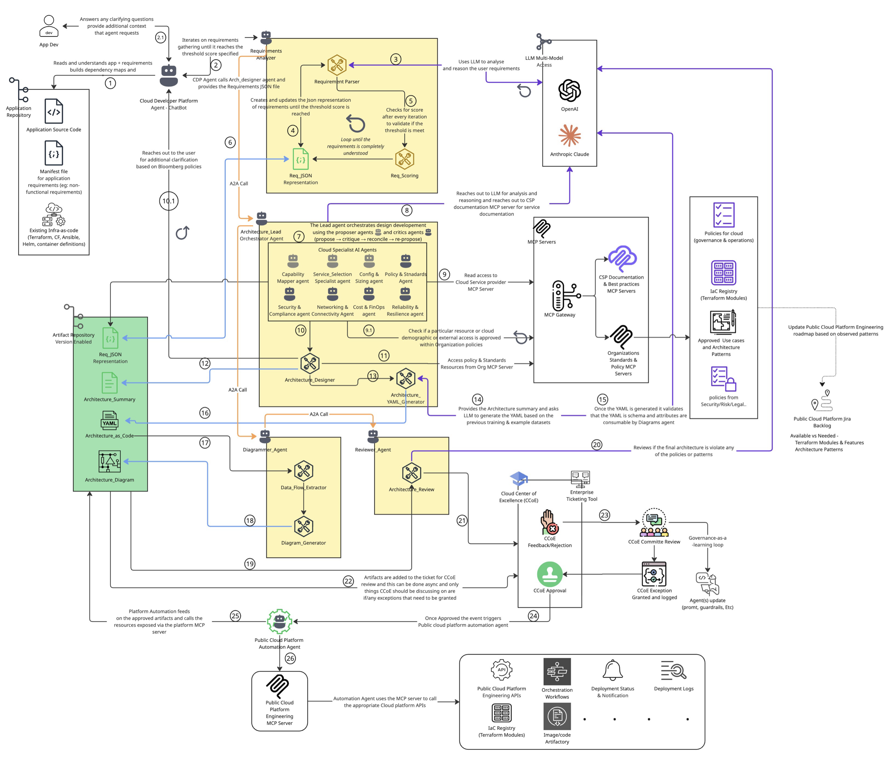

# CDP-Agents — A Cloud Developer Platform Built From AI Agents

> **The pitch:** Turn "I need to ship this app to the cloud" into a **reviewed, policy-compliant, automatically-provisioned architecture** — designed, diagrammed, governed, and deployed by a fleet of cooperating AI agents.
>
> Today this repo ships the **Architecture Design Agent** (requirements → AWS design → diagram) and a **Terraform-state → diagram** tool. That's the first two organs of a much bigger body. **This README describes where we're going — and where you come in.** 👇

---

## 🌅 The Vision

Most cloud platform engineering is a relay race of humans: a developer writes requirements, an architect designs, a security reviewer pokes holes, a Cloud Center of Excellence (CCoE) approves, and a platform team finally provisions. It's slow, inconsistent, and the institutional knowledge lives in people's heads.

**CDP-Agents replaces that relay race with an agentic platform.** A developer describes their app in plain language; a coordinated fleet of specialist agents gathers requirements, designs a Well-Architected solution against *your organization's* policies and approved patterns, draws the diagrams, self-reviews against governance rules, routes exceptions to the CCoE, and — once approved — drives the actual provisioning through your platform automation.

Every decision is grounded in two MCP-served sources of truth:
- **Cloud Service Provider (CSP) docs & best practices** — so designs use services correctly.
- **Your org's standards, policies, approved use-cases & IaC registry** — so designs are *compliant by construction*, not compliant-after-rejection.

And it's a **learning loop**: CCoE feedback and observed patterns feed back into agent prompts, guardrails, and the platform engineering roadmap.

```
Developer intent  →  Requirements  →  Architecture  →  Diagrams  →  Governance review  →  Provisioning
   (natural lang)     (scored loop)    (specialist     (as-code)     (auto + CCoE)         (MCP-driven)
                                        agent panel)
```

---

## 🗺️ The Full Flow (target architecture)

The diagram below is the north star. Numbers map to the end-to-end flow; **✅ = shipping today**, **🚧 = in progress**, **📋 = planned / open for contribution**.



> The numbered table below mirrors this diagram, stage by stage.

| # | Stage | What happens | Status |
|---|-------|--------------|--------|
| 1–2 | **CDP ChatBot** (Cloud Developer Platform Agent) | Reads the app repo (source, manifest, existing IaC), builds dependency maps, and chats with the developer to gather intent. Hands a Requirements JSON to the design pipeline. | 📋 |
| 2.1 | **Clarification loop** | Asks the developer targeted follow-ups based on org policies. | 🚧 |
| 3–5 | **Requirements Analyzer** | `Requirement Parser` → `Req JSON Representation` → `Req Scoring`, looping until a completeness threshold is met. | 🚧 (req. gathering ✅, scoring loop 📋) |
| 6 | A2A hand-off | Requirements Analyzer → Architecture Lead via agent-to-agent call. | 📋 |
| 7 | **Architecture Lead Orchestrator** | Runs a *propose → critique → reconcile → re-propose* design loop over a panel of specialist agents. | 📋 |
| — | **Cloud Specialist Agents** | Capability Mapper · Service Selection · Config & Sizing · Policy & Standards · Security & Compliance · Networking & Connectivity · Cost & FinOps · Reliability & Resilience. | 📋 |
| 8–9.1 | **MCP Gateway** | Read access to **CSP Documentation MCP** (AWS docs ✅) and **Org Standards/Policy MCP** (approved use-cases, IaC registry, security/risk/legal policies). | ✅ (CSP) / 📋 (Org) |
| 10–13 | **Architecture Designer → YAML Generator** | Produces the design, the Architecture Summary, and validated diagrams-as-code YAML. | ✅ |
| 14–15 | LLM-assisted YAML + schema validation | LLM generates YAML from the summary; output is validated against the diagrams schema. | ✅ |
| 16–19 | **Diagrammer Agent** | `Data Flow Extractor` → `Diagram Generator` → rendered Architecture Diagram (PNG). | ✅ |
| 20 | **Reviewer Agent** | `Architecture Review` checks the final design against org policies & approved patterns. | 📋 |
| 21–24 | **CCoE governance** | Artifacts attach to a ticket; CCoE feedback/rejection, committee review, exceptions granted & logged, approval. | 📋 |
| 25–26 | **Platform Automation Agent** | On approval, consumes approved artifacts and calls the **Platform Engineering MCP Server** to provision (orchestration workflows, IaC registry, deployment status/logs). | 📋 |
| — | **Learning loop** | CCoE decisions & observed patterns update agent prompts/guardrails and feed the Public Cloud Platform Jira backlog / engineering roadmap. | 📋 |

**Artifacts** are versioned in an artifact repository throughout: `Req JSON`, `Architecture Summary`, `Architecture as Code (YAML)`, `Architecture Diagram`.

---

## ✅ What Works Today

This repo is a **working, runnable foundation** — not vaporware. Two components ship now:

### 1. Architecture Design Agent
A specialized agent (built on the [Strands](https://strandsagents.com/) platform via the AWS [Agent Dev Toolkit](adt-readme.md)) that walks an AWS architecture from requirements to a rendered diagram:

1. **Requirements Analysis** — understands business context and asks app- + infra-focused questions *before* touching AWS docs.
2. **AWS Component Analysis** — queries the AWS Documentation MCP server for real service capabilities.
3. **Progressive Questioning** — broad → specific, refining the design.
4. **Architecture Design** — produces a Well-Architected design (security, reliability, performance, cost, ops, sustainability).
5. **Diagram Generation** — emits diagrams-as-code YAML and renders a PNG.

**Tools available now:**
- `analyze_and_question` — identify components & generate targeted questions
- `finalize_architecture` — produce the final design from answers
- `convert_architecture_to_yaml` — design → diagrams-as-code YAML (LLM-driven relationships by default)
- `generate_diagram_from_yaml` — YAML → PNG
- `validate_yaml_schema` — validate YAML against the diagrams schema
- `read_tfstate` — summarize a Terraform state file (local or S3)
- `tfstate_to_diagram` — Terraform state → architecture diagram (YAML + PNG)

### 2. Terraform State → Diagram
Reverse-engineer an architecture diagram straight from your `.tfstate` — no manual drawing.

```
.tfstate (JSON) → Parse Resources → Map to Diagram Types → Infer Relationships → YAML + PNG
```

1. **Parse** — extract managed resources, skip plumbing (subnets, SGs, IAM policies…).
2. **Map** — 120+ entry mapping table (`aws_lambda_function` → `aws.compute.Lambda`).
3. **Infer** — ARN-based lookups + architectural patterns (API GW → Lambda, ALB → ECS, SNS → SQS).
4. **Generate** — diagrams-as-code YAML, rendered to PNG via Graphviz.

**LLM-enhanced mode** (`enhance_with_llm='true'`) runs the deterministic pass, then asks Bedrock to add missing edges, drop wrong ones, and improve labels:

```python
result = tfstate_to_diagram(
    source='path/to/terraform.tfstate',
    diagram_name='My Infrastructure',
    output_folder='output',
    enhance_with_llm='true',
)
```

**Filter resources** with `include_types` / `exclude_types`:

```python
tfstate_to_diagram(source='terraform.tfstate', diagram_name='Compute Only',
                   include_types='aws_lambda_function,aws_ecs_cluster,aws_ecs_service')
tfstate_to_diagram(source='terraform.tfstate', diagram_name='No Monitoring',
                   exclude_types='aws_cloudwatch_log_group,aws_cloudwatch_metric_alarm')
```

---

## 🚀 Quick Start

### Prerequisites
- Python 3.10+
- Node.js 18+ (for UI assets)
- Graphviz (`brew install graphviz` on macOS)
- Docker (optional — for container mode and the Terraform MCP server)
- AWS credentials (Bedrock LLM, and optionally S3 for remote tfstate)

### 1. Set up the environment
```bash
git clone https://github.com/Aendapally/CDP-Agents
cd CDP-Agents

python -m venv .venv
source .venv/bin/activate          # Windows: .venv\Scripts\activate

pip install git+https://github.com/awslabs/agent-dev-toolkit.git
```

### 2. Run the Architecture Design Agent
```bash
cd arch-design
pip install -r requirements.txt

# Provide AWS creds (pick one):
export AWS_ACCESS_KEY_ID=your_access_key
export AWS_SECRET_ACCESS_KEY=your_secret_key
export AWS_REGION=us-west-2
#   …or:  adt dev --aws-profile your-profile
#   …or:  adt dev --env-file .env

adt dev --port 8083
```
Visit **http://localhost:8083** to chat with the agent.

---

## 📁 Project Structure

```
CDP-Agents/
├── README.md                              # ← you are here
├── adt-readme.md                          # Agent Dev Toolkit reference
├── ref.yaml                               # Diagrams-as-code YAML format reference
├── arch-design/                           # THE APPLICATION (today's slice)
│   ├── .agent.yaml                        # Agent config (model, system prompt, MCP servers)
│   ├── Dockerfile                         # Container deployment
│   ├── container_entrypoint.py            # Container entry point
│   ├── src/
│   │   ├── agent.py                       # Main agent — loads config, model, tools
│   │   ├── mcp_client.py                  # MCP connection factory
│   │   ├── mcp_tools.py                   # MCP tool loader
│   │   ├── Diagrams-as-code-schema.json   # YAML validation schema
│   │   └── tools/
│   │       ├── architecture_orchestrator.py   # Requirements & questioning
│   │       ├── aws_architecture_designer.py   # Architecture design
│   │       ├── architecture_to_yaml.py        # Text → YAML (LLM-driven relationships)
│   │       ├── yaml_to_diagram.py             # YAML → PNG
│   │       ├── tfstate_to_diagram.py          # Terraform state → diagram
│   │       ├── diagrams_as_code_reference.py  # Reference data for the LLM
│   │       └── requirements_reviewer.py       # Requirements helper
│   └── test_data/                         # Sample .tfstate files
└── archive/                               # Archived files (gitignored)
```

---

## ⚙️ Configuration

### Agent config (`arch-design/.agent.yaml`)
One YAML drives the model, system prompt, and MCP servers:

```yaml
name: arch_design-agent
system_prompt: |
  You are an AWS Architecture Design Specialist Agent...

provider:
  class: "strands.models.BedrockModel"
  kwargs:
    model_id: "global.anthropic.claude-sonnet-4-6"
    region_name: "us-west-2"
    max_tokens: 4096

mcp_servers:
  - name: aws_documentation
    transport: stdio
    command: ["uvx", "awslabs.aws-documentation-mcp-server@latest"]
  - name: terraform
    transport: stdio
    command: ["docker", "run", "-i", "--rm", "hashicorp/terraform-mcp-server"]
```

The provider is swappable — Bedrock, Anthropic, OpenAI, and LiteLLM snippets are included in the file. Keys ending in `_env` are resolved from environment variables so secrets stay out of source control.

### Environment variables (`.env`)
```env
AWS_ACCESS_KEY_ID=your_access_key
AWS_SECRET_ACCESS_KEY=your_secret_key
AWS_REGION=us-west-2
```

---

## 🛠️ Development

```bash
# Scaffold a new tool
adt add tool my_tool_name              # → src/tools/my_tool_name.py

# Container mode
adt dev --container --port 9000
adt dev --container --rebuild --port 9000   # rebuild after dep changes

# MCP deps
pip install mcp uv
```

---

## 🤝 Contributing — Help Us Build the Rest of the Platform

**This is the part that matters.** We have a solid spine (design + diagram); the limbs are open. If you care about agentic systems, cloud governance, or platform engineering, there's a meaty, well-scoped piece here with your name on it.

### High-impact areas open for contribution

| Area | What's needed | Good for |
|------|---------------|----------|
| 🧠 **Requirements scoring loop** | Implement `Req Scoring` + threshold loop (steps 3–5) so requirements iterate until "complete." | Agent prompt/eval engineers |
| 🤖 **Specialist agent panel** | Build the Cloud Specialist agents (Capability Mapper, Service Selection, Security & Compliance, Cost & FinOps, etc.) and the Lead Orchestrator's *propose → critique → reconcile* loop (step 7). | Multi-agent system builders |
| 📚 **Org Standards/Policy MCP** | Stand up the MCP server that serves approved use-cases, IaC registry, and security/risk/legal policies (steps 9–9.1). | MCP / platform devs |
| 🔍 **Reviewer Agent** | Architecture review against org policies & patterns (step 20). | Security / governance folks |
| 🏛️ **CCoE governance integration** | Wire artifacts into a ticketing tool; model feedback/rejection/exception/approval (steps 21–24). | Enterprise integration devs |
| 🚢 **Platform Automation Agent** | On approval, drive provisioning via a Platform Engineering MCP server (steps 25–26). | IaC / automation devs |
| 🔁 **Learning loop** | Feed CCoE decisions & observed patterns back into prompts, guardrails, and the roadmap backlog. | ML/ops + feedback-loop designers |
| ☁️ **Multi-cloud** | Generalize beyond AWS (Azure, GCP) in the designer, mappings, and diagram output. | Cloud generalists |

### How to contribute
1. Fork the repo and create a feature branch.
2. Pick an item above (or open an issue to propose one) — small, focused PRs welcome.
3. Add tests/sample data where it makes sense (`arch-design/test_data/` has examples).
4. Open a PR describing which part of the flow you're advancing.

New here? Good first issues: extend the Terraform→diagram mapping table, add `.tfstate` test fixtures, or improve diagrams-as-code coverage for more AWS services.

---

## 📚 Documentation & Acknowledgments

- [ADT Documentation](adt-readme.md) — Agent Development Toolkit guide
- [Architecture Agent README](arch-design/README.md) — agent-specific docs
- [Diagrams-as-code YAML reference](ref.yaml)

Built on:
- [Strands platform](https://strandsagents.com/) — agent runtime
- [agent-dev-toolkit](https://github.com/awslabs/agent-dev-toolkit) — agent scaffolding & dev server
- [diagrams-as-code](https://github.com/dmytrostriletskyi/diagrams-as-code) — YAML diagram spec
- [diagrams](https://github.com/mingrammer/diagrams) (Graphviz) — PNG rendering
- [AWS Documentation MCP Server](https://github.com/awslabs/aws-documentation-mcp-server)
- [Terraform MCP Server](https://github.com/hashicorp/terraform-mcp-server)
- [Model Context Protocol](https://github.com/modelcontextprotocol)

## License
MIT — see the `LICENSE` file.

---

**Made for the CDP and AI-agent ecosystem.** Got an idea for an agent in the flow? Open an issue — let's build the platform that builds the platforms. 🚀
